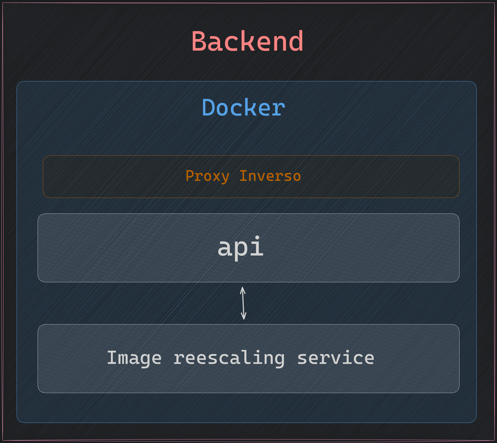

# Backend

El propósito de este repositorio es generar un backend sólido aprendiendo una tecnología nueva como es .Net

Metas principales a realizar con este backend:

- Conectar con una base de datos SQL
- Implementar un CRUD e interfaces de comunicación con dicha BBDD
- Implementar autenticación para ciertos recursos/endpoints
- Replicar el funcionamiento de Wordpress con un admin-area
- Replicar el funcionamiento de Wordpress con un Blog manager

Con esta aplicación queremos recrear un poco el funcionamiento de Wordpress con un admin-area, que nos permita manejar múltiples aspectos de nuestra web y configuración, así como un blog.

El blog y admin-area tienen como finalidad aparte de darle más complejidad al proyecto del Portfolio, darnos un buen insight en la creación de este tipo de sistemas más complicados.

## Estructura principal backend

La idea principal de este backend es utilizar todas 

El plan es automatizar todo esto con CI/CD por lo que probablemente también contemos con archivos docker e instrucciones de ensamblaje para Github actions.

## Estructura principal BBDD

Las tecnologías principales que estoy pensando usar son PostgreSQL o Supabase.

- PostgreSQL es una base de datos como tal con su gestor, por lo que se tiene que implementar todo desde 0.
- Supabase es más un SAAS (Software as a Service) por lo que no solo cuenta con una base de datos PostgreSQL, si no que cuenta con múltiples servicios de Auth ya implementados.

> Por ahora he decidido usar PostgreSQL, ya que quiero adentrarme en el Lenguaje GO por completo e implementar toda la funcionalidad desde 0 a mano por mi cuenta. Pero puede que en un futuro eso cambie.

[Esquema entidad-relacion](./docs/PortfolioDB.png)

La idea principal de esta infraestructura es tener todas las entidades principales necesarias para recrear en parte el funcionamiento de Wordpress de una manera sencilla y rápida.

### Herramientas adicionales

